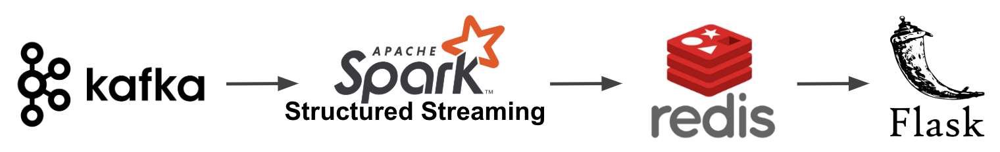

# Table of Contents
1. [Introduction](README.md#introduction)
2. [Pipeline](README.md#pipeline)
3. [Getting Started](README.md#gettingstarted)

# Introduction

Flights with layovers are generally cheaper than direct flights. What if your layover became your destination?

This is a real time pricing solution for low cost airfare. Streaming is important because consumers should make their purchase decision on the latest airfare. This application will surface the latest and lowest price for a trip.

Check out the finished product here: www.jetlagged.xyz

# Pipeline

Multi airline pricing updates are simulated using Kafka producers. Streams converge into Spark Structured Streams where they are processed into key value pairs to optimize Redis caching capabilities. Spark Structured Streaming also lays the foundation for analytic capabilities for the product's evolution. The application, built with Flask, submits user requests to Redis. This is an O(1) lookup. 

# Getting Started

#### Code Environment
`build.sbt` shows all code dependencies and versions.

#### Cluster Environment
This project used 3 clusters with Zookeeper, Kafka, Hadoop, Spark, and Redis installed.
* 4 nodes for Kafka producers 
* 4 nodes for Spark Structured Streaming consumer
* 1 node for Redis

